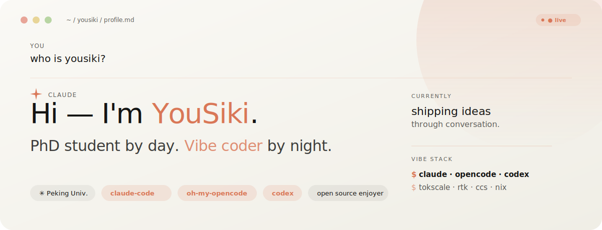

<!-- ──────────────────────────────────────────────────────────────
     yousiki / yousiki
     a Claude-styled profile · built with vibes, shipped in prose
     ────────────────────────────────────────────────────────────── -->

 

  
  
  

<!--                                                                  -->
<!--  ✳︎  V I B E   C O D I N G   D A S H B O A R D                    -->
<!--                                                                  -->

### <kbd>✳︎</kbd>&nbsp;&nbsp;vibe coding dashboard

<table width="100%">
<tr>
<td align="left" width="50%"><code>&nbsp;✳︎&nbsp;&nbsp;<b>LIVE</b>&nbsp;·&nbsp;tokscale.ai/u/yousiki</code></td>
<td align="right" width="50%"><i>every token I've conjured with an agent, counted.</i></td>
</tr>
</table>

  

  
  
  

<!--                                                                  -->
<!--  ✳︎  A G E N T   S T A C K                                        -->
<!--                                                                  -->

### <kbd>✳︎</kbd>&nbsp;&nbsp;daily agent stack

<!--                                                                  -->
<!--  ✳︎  C O N T R I B U T I O N   C A N V A S                        -->
<!--                                                                  -->

### <kbd>✳︎</kbd>&nbsp;&nbsp;contribution canvas

  

<!--                                                                  -->
<!--  ✳︎  F O O T E R                                                  -->
<!--                                                                  -->

  
    <code>✳︎</code>&nbsp;&nbsp;crafted with Claude Code&nbsp;·&nbsp;palette borrowed from <a href="https://claude.ai">claude.ai</a>&nbsp;·&nbsp;dashboard powered by <a href="https://tokscale.ai">tokscale</a>
  

  
    <code>$&nbsp;claude&nbsp;--continue</code>
  

